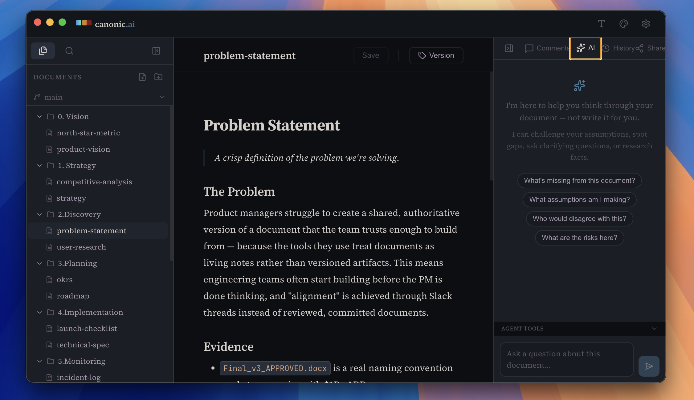

<div align="center">


# Canonic

**Local-first document editor for product teams — powered by Git.**

[Download](#installation) · [Docs](docs/) · [Report a Bug](https://github.com/Canonical-AI/canonic/issues)

---

[](LICENSE)
[](package.json)
[](#installation)

</div>

---

> **Write first. Build second.**  
> Canonic is a markdown editor that keeps your product artifacts organized, versioned, and always on your machine — with an AI assistant designed to help you *think*, not to think for you.

---

<div align="center">



</div>

---

## Why Canonic

Product work lives in too many places. Strategy docs in Notion, specs in Confluence, decisions in Slack threads, and history nowhere. Canonic brings it together in one local-first workspace — backed by Git so nothing is ever lost.

| Without Canonic | With Canonic |
|---|---|
| Scattered artifacts across tools | Everything in one workspace |
| No version history on decisions | Full Git history on every document |
| AI that writes for you | AI that helps you think |
| Lock-in to cloud providers | Your files, on your machine |
| "Final\_v2\_FINAL.doc" chaos | Clean branches and checkpoints |

---

## Features

### Local-First, Always Yours
All documents live on your machine as plain markdown files. No sync issues, no subscriptions required, no vendor lock-in. Open your workspace in any text editor — Canonic just makes it better.

### Git-Powered Versioning
Every workspace is a Git repository. Save checkpoints, branch per document, view full history, and resolve conflicts — without ever touching a terminal. Drop Canonic on an existing repo and it adapts automatically.

### AI That Respects Your Thinking
The built-in assistant is configured to *brainstorm and review*, not to write for you. It asks questions, surfaces gaps, and helps you sharpen ideas — designed for people who want to do their own thinking before they build.

### Structured for Product Work
Start from a blank canvas or use the **PM Framework** template — structured around the documents that actually matter: vision, personas, features, decisions, retros, and GTM.

### Inline Comments & Collaboration
Anchor comments to specific text selections. Share workspaces via token-secured links with granular access controls at the file, directory, or workspace level.

### Works With Your Existing Repos
Open any folder with a `.git` directory — Canonic detects it, skips re-initialization, shows real commit history, and commits alongside your other tools without interfering.

---

## Getting Started

### Prerequisites

- [Node.js](https://nodejs.org/) v16+
- npm

### Run Locally

```bash
git clone https://github.com/Canonical-AI/canonic.git
cd canonic
npm install
npm run dev
```

This starts both the Vite dev server and the Electron window.

### Build for Production

```bash
npm run build
```

Output goes to `dist-electron/`. Canonic uses [electron-builder](https://www.electron.build/) and distributes via GitHub Releases with automatic background updates.

---

## Tech Stack

| Layer | Technology |
|---|---|
| UI Framework | [Vue 3](https://vuejs.org/) + [Vite](https://vitejs.dev/) |
| Desktop Shell | [Electron](https://www.electronjs.org/) |
| Editor | [Milkdown](https://milkdown.dev/) |
| Version Control | [isomorphic-git](https://isomorphic-git.org/) |
| State Management | [Pinia](https://pinia.vuejs.org/) |
| Search | [FlexSearch](https://github.com/nextapps-de/flexsearch) |
| AI | OpenRouter (OpenAI-compatible, multi-model) |

---

## Architecture

```
canonic/
├── electron/          # Main process, IPC handlers, git operations
├── src/               # Vue 3 frontend (renderer process)
│   ├── components/    # UI components
│   ├── stores/        # Pinia state management
│   └── composables/   # Shared logic
├── docs/              # Project documentation and specs
└── public/            # Static assets
```

**Key design decisions:**
- Two-process Electron architecture — renderer never touches the filesystem directly
- Per-document Git branching — each doc lives on its own branch, merged back on save
- Sidecar storage — comments and config live in `~/.canonic/`, separate from workspace files
- IPC-first — all file, git, and AI operations go through typed IPC handlers

---

## Configuration

User preferences and AI API keys are stored in `~/.canonic/config.json`. Canonic supports any OpenAI-compatible provider via [OpenRouter](https://openrouter.ai/).

Set your API key in **Settings → AI** within the app.

---

## Contributing

See [CONTRIBUTING.md](docs/CONTRIBUTING.md) for development setup, branching conventions, and PR guidelines.

---

## License

MIT — see [LICENSE](LICENSE).

---

<div align="center">

Built with care for people who think before they build.

</div>
