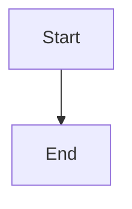

# Editor Features Implementation Plan

> **For agentic workers:** REQUIRED SUB-SKILL: Use superpowers:subagent-driven-development (recommended) or superpowers:executing-plans to implement this plan task-by-task. Steps use checkbox (`- [ ]`) syntax for tracking.

**Goal:** Add hyperlink editing, `[[wiki-link]]` doc references, and mermaid diagram rendering to the Milkdown editor.

**Architecture:** Feature 1 (links) adds a toolbar button + URL input to `Editor.vue` using the existing commonmark link mark via `defineExpose` on `MilkdownEditor.vue`. Feature 2 (mermaid) upgrades Milkdown to 7.13.x and registers `@milkdown/plugin-diagram` with a custom Vue node view. Feature 3 (wiki-links) adds a chokidar file index in the main process, a custom remark plugin + Milkdown node, and three Vue chip components (resolved / new / broken).

**Tech Stack:** Milkdown 7.13.x, ProseMirror, Vue 3, Vitest, chokidar, mermaid ^11, @prosemirror-adapter/vue, unist-util-visit

---

## File Map

**Created:**
- `electron/fileIndex.js` — chokidar watcher + `{ name → relPath }` index
- `src/components/editor/wiki-link/index.js` — remark plugin + `$node` definition
- `src/components/editor/wiki-link/WikiLinkChip.vue` — resolved/new/broken chip renderer
- `src/components/editor/wiki-link/WikiLinkTooltip.vue` — `[[` autocomplete dropdown
- `src/components/editor/MermaidComponent.vue` — preview/editor tab diagram card
- `tests/unit/fileIndex.test.js` — index build + watcher tests
- `tests/unit/wikiLinkRemark.test.js` — remark plugin parse/serialize tests

**Modified:**
- `src/components/editor/MilkdownEditor.vue` — expose link commands; register diagram + wiki-link plugins
- `src/components/editor/Editor.vue` — link toolbar button + collapsible URL input
- `electron/main.js` — IPC handlers: `files:index`, watcher lifecycle
- `electron/preload.js` — expose `api.files.getIndex` + `api.files.onIndexUpdate`
- `src/store/index.js` — reactive `fileIndex`, load on workspace open
- `package.json` — upgrade `@milkdown/*` to 7.13.x; add `mermaid`, `@milkdown/plugin-diagram`, `@prosemirror-adapter/vue`, `chokidar`, `unist-util-visit`

---

## Feature 1: Links

### Task 1 — Expose link commands from MilkdownEditor

**Files:**
- Modify: `src/components/editor/MilkdownEditor.vue`

- [ ] **Step 1: Add imports and expose block**

In `MilkdownEditor.vue`, add to the existing `<script setup>` imports:

```js
import { editorViewCtx } from '@milkdown/core'
```

Then append before the closing `</script>`:

```js
function getLinkMark() {
  return get()?.action((ctx) => {
    const view = ctx.get(editorViewCtx)
    return view?.state.schema.marks.link ?? null
  }) ?? null
}

function hasLinkAtSelection() {
  return get()?.action((ctx) => {
    const view = ctx.get(editorViewCtx)
    if (!view) return false
    const { from, to } = view.state.selection
    const linkMark = view.state.schema.marks.link
    if (!linkMark) return false
    return view.state.doc.rangeHasMark(from, to, linkMark)
  }) ?? false
}

function addLink(url) {
  get()?.action((ctx) => {
    const view = ctx.get(editorViewCtx)
    if (!view) return
    const { from, to } = view.state.selection
    const linkMark = view.state.schema.marks.link
    if (!linkMark) return
    const tr = view.state.tr.addMark(from, to, linkMark.create({ href: url, title: '' }))
    view.dispatch(tr)
  })
}

function removeLink() {
  get()?.action((ctx) => {
    const view = ctx.get(editorViewCtx)
    if (!view) return
    const { from, to } = view.state.selection
    const linkMark = view.state.schema.marks.link
    if (!linkMark) return
    view.dispatch(view.state.tr.removeMark(from, to, linkMark))
  })
}

defineExpose({ hasLinkAtSelection, addLink, removeLink })
```

- [ ] **Step 2: Verify the app still compiles**

```bash
cd /Users/johnazzinaro/Coding/canonic-local && npm run dev
```

Expected: app opens, no console errors.

- [ ] **Step 3: Commit**

```bash
git add src/components/editor/MilkdownEditor.vue
git commit -m "feat: expose link commands from MilkdownEditor"
```

---

### Task 2 — Link toolbar button + URL input in Editor.vue

**Files:**
- Modify: `src/components/editor/Editor.vue`

- [ ] **Step 1: Add milkdown ref and link state to script**

In `Editor.vue`, after the existing `import` block, add:

```js
import { Link } from 'lucide-vue-next'
```

Then add to the existing `import { ..., GitBranch }` line — add `Link` to that destructure. Then after `const showMergeConfirm = ref(false)` add:

```js
const milkdownEditor = ref(null)
const isAddingLink = ref(false)
const linkUrl = ref('')
const linkInput = ref(null)
const linkButtonActive = ref(false)
```

- [ ] **Step 2: Add link functions to script**

Add these functions after the `doMerge` function:

```js
function toggleLink() {
  if (isAddingLink.value) {
    isAddingLink.value = false
    linkUrl.value = ''
    return
  }
  if (milkdownEditor.value?.hasLinkAtSelection()) {
    milkdownEditor.value.removeLink()
    linkButtonActive.value = false
    return
  }
  isAddingLink.value = true
  linkButtonActive.value = true
  nextTick(() => linkInput.value?.focus())
}

async function submitLink() {
  const url = linkUrl.value.trim()
  if (!url) return
  milkdownEditor.value?.addLink(url)
  isAddingLink.value = false
  linkUrl.value = ''
  linkButtonActive.value = false
}

function cancelLink() {
  isAddingLink.value = false
  linkUrl.value = ''
  linkButtonActive.value = false
}
```

- [ ] **Step 3: Add link button to topbar template**

In the template, find `.topbar-actions` div. After the opening `<div class="topbar-actions">` tag, add the link button as the first item (before the unsaved label span):

```html
<button
  class="action-btn icon-label"
  :class="{ 'link-btn-active': linkButtonActive }"
  @click="toggleLink"
  title="Add or remove link"
>
  <Link :size="13" />
  Link
</button>
<div class="topbar-divider" />
```

- [ ] **Step 4: Add URL input row below topbar**

After the closing `</div>` of `.editor-topbar`, add:

```html
<transition name="link-input-slide">
  <div v-if="isAddingLink" class="link-input-row">
    <input
      ref="linkInput"
      v-model="linkUrl"
      class="link-url-input"
      placeholder="Enter URL (e.g., https://example.com)"
      @keydown.enter.prevent="submitLink"
      @keydown.esc="cancelLink"
    />
    <button class="action-btn" @click="cancelLink">Cancel</button>
    <button class="action-btn link-add-btn" @click="submitLink">Add Link</button>
  </div>
</transition>
```

- [ ] **Step 5: Wire MilkdownEditor ref**

Find the `<MilkdownEditor` tag in the template and add `ref="milkdownEditor"`:

```html
<MilkdownEditor
  ref="milkdownEditor"
  :content="localContent"
  :comments="store.comments"
  @update="onContentUpdate"
/>
```

- [ ] **Step 6: Add CSS for link input row**

Append to the `<style scoped>` block:

```css
.link-btn-active {
  background: var(--bg-hover);
  color: var(--accent);
  border-color: var(--accent-muted);
}

.link-input-row {
  display: flex;
  align-items: center;
  gap: 8px;
  padding: 8px 48px;
  border-bottom: 1px solid var(--border);
  background: var(--bg-secondary);
  flex-shrink: 0;
}

.link-url-input {
  flex: 1;
  padding: 5px 10px;
  border: 1px solid var(--border);
  border-radius: 6px;
  background: var(--bg-primary);
  color: var(--text-primary);
  font-size: 0.8125rem;
  font-family: inherit;
  outline: none;
}

.link-url-input:focus { border-color: var(--accent-muted); }

.link-add-btn {
  color: var(--accent);
  border-color: var(--accent-muted);
}

.link-input-slide-enter-active,
.link-input-slide-leave-active {
  transition: all 0.15s ease;
  overflow: hidden;
}

.link-input-slide-enter-from,
.link-input-slide-leave-to {
  max-height: 0;
  opacity: 0;
  padding-top: 0;
  padding-bottom: 0;
}

.link-input-slide-enter-to,
.link-input-slide-leave-from {
  max-height: 60px;
  opacity: 1;
}
```

- [ ] **Step 7: Smoke test**

Start the app, open a doc, select some text, click the Link button. Confirm:
- URL input row slides in
- Typing a URL and pressing Enter applies a link (text turns into a clickable link in the rendered markdown)
- With cursor inside a link, clicking Link button removes the link mark
- Escape closes the input

```bash
npm run dev
```

- [ ] **Step 8: Commit**

```bash
git add src/components/editor/Editor.vue
git commit -m "feat: add link toolbar button and URL input to editor"
```

---

## Feature 2: Mermaid Diagrams

### Task 3 — Upgrade Milkdown + install mermaid packages

**Files:**
- Modify: `package.json`

- [ ] **Step 1: Upgrade Milkdown and install new packages**

```bash
cd /Users/johnazzinaro/Coding/canonic-local
npm install \
  @milkdown/core@^7.13.1 \
  @milkdown/plugin-history@^7.13.1 \
  @milkdown/plugin-listener@^7.13.1 \
  @milkdown/preset-commonmark@^7.13.1 \
  @milkdown/preset-gfm@^7.13.1 \
  @milkdown/theme-nord@^7.13.1 \
  @milkdown/vue@^7.13.1 \
  @milkdown/utils@^7.13.1 \
  @milkdown/plugin-diagram@^7.13.1 \
  mermaid@^11.6.0 \
  @prosemirror-adapter/vue@^0.4.1 \
  chokidar@^4.0.0 \
  unist-util-visit@^5.0.0
```

- [ ] **Step 2: Verify app still starts after upgrade**

```bash
npm run dev
```

Expected: app opens, existing editor features (comments, history, GFM) still work. If there are import errors, check the Milkdown changelog — most 7.5→7.13 changes are additive, but `editorViewCtx` may have moved to `@milkdown/core` (it was already there).

- [ ] **Step 3: Run existing tests**

```bash
npm test
```

Expected: all existing tests pass.

- [ ] **Step 4: Commit**

```bash
git add package.json package-lock.json
git commit -m "chore: upgrade milkdown to 7.13.x, add mermaid + prosemirror-adapter"
```

---

### Task 4 — MermaidComponent.vue

**Files:**
- Create: `src/components/editor/MermaidComponent.vue`

- [ ] **Step 1: Create the component**

```vue
<template>
  <div
    class="mermaid-card"
    @mouseenter="hovering = true"
    @mouseleave="hovering = false"
  >
    <div class="mermaid-body">
      <div v-if="tab === 'preview'" class="mermaid-preview">
        <div v-if="renderError" class="mermaid-error">{{ renderError }}</div>
        <div v-else v-html="renderedSvg" class="mermaid-svg" />
      </div>
      <div v-else class="mermaid-editor-tab">
        <textarea
          v-model="source"
          class="mermaid-textarea"
          spellcheck="false"
          :rows="sourceRows"
        />
        <div class="mermaid-editor-footer">
          <span class="mermaid-hint">Mermaid diagram</span>
          <button class="mermaid-btn" @click="tab = 'preview'">Update</button>
        </div>
      </div>
    </div>
    <div v-if="hovering" class="mermaid-tabs">
      <button
        class="mermaid-tab"
        :class="{ active: tab === 'preview' }"
        @click="tab = 'preview'"
      >Preview</button>
      <button
        class="mermaid-tab"
        :class="{ active: tab === 'editor' }"
        @click="tab = 'editor'"
      >Editor</button>
    </div>
  </div>
</template>

<script setup>
import { ref, watch, computed, onMounted, inject } from 'vue'
import { useNodeViewContext } from '@prosemirror-adapter/vue'
import mermaid from 'mermaid'

const { node, setAttrs } = useNodeViewContext()

const tab = ref('preview')
const hovering = ref(false)
const renderedSvg = ref('')
const renderError = ref('')
let renderTimer = null
let renderCounter = 0

const source = ref(node.value.attrs.value || '')

const sourceRows = computed(() => Math.max(4, source.value.split('\n').length + 1))

function initMermaid(dark) {
  mermaid.initialize({
    startOnLoad: false,
    securityLevel: 'loose',
    theme: dark ? 'dark' : 'default',
    fontFamily: 'inherit',
    maxTextSize: 100000
  })
}

const isDark = inject('isDark', ref(false))

onMounted(() => {
  initMermaid(isDark.value)
  renderDiagram()
})

watch(isDark, (dark) => {
  initMermaid(dark)
  renderDiagram()
})

watch(source, () => {
  clearTimeout(renderTimer)
  renderTimer = setTimeout(() => {
    renderDiagram()
    setAttrs({ value: source.value })
  }, 300)
})

watch(() => node.value.attrs.value, (val) => {
  if (val !== source.value) source.value = val || ''
})

async function renderDiagram() {
  const id = `mermaid-${++renderCounter}`
  try {
    const { svg } = await mermaid.render(id, source.value)
    renderedSvg.value = svg
    renderError.value = ''
  } catch (e) {
    renderError.value = e.message || 'Invalid diagram syntax'
    renderedSvg.value = ''
  }
}
</script>

<style scoped>
.mermaid-card {
  border: 1px solid var(--border);
  border-radius: 8px;
  overflow: hidden;
  margin: 8px 0;
  background: var(--bg-secondary);
}

.mermaid-body { padding: 16px; }

.mermaid-preview { min-height: 40px; }

.mermaid-svg :deep(svg) {
  width: 100% !important;
  height: auto !important;
  max-width: 100% !important;
  overflow: visible !important;
  display: block;
}

.mermaid-error {
  color: var(--text-error, #e05252);
  font-size: 0.8125rem;
  font-family: 'JetBrains Mono', monospace;
  padding: 8px;
  background: rgba(224, 82, 82, 0.08);
  border-radius: 4px;
}

.mermaid-textarea {
  width: 100%;
  font-family: 'JetBrains Mono', monospace;
  font-size: 0.8125rem;
  background: var(--bg-primary);
  color: var(--text-primary);
  border: 1px solid var(--border);
  border-radius: 4px;
  padding: 8px;
  resize: vertical;
  outline: none;
  line-height: 1.5;
  box-sizing: border-box;
}

.mermaid-editor-footer {
  display: flex;
  align-items: center;
  justify-content: space-between;
  margin-top: 8px;
}

.mermaid-hint { font-size: 0.75rem; color: var(--text-muted); }

.mermaid-btn {
  padding: 3px 12px;
  border-radius: 5px;
  border: 1px solid var(--border);
  background: transparent;
  color: var(--text-secondary);
  font-size: 0.8rem;
  cursor: pointer;
}

.mermaid-btn:hover { background: var(--bg-hover); }

.mermaid-tabs {
  display: flex;
  border-top: 1px solid var(--border);
}

.mermaid-tab {
  flex: 1;
  padding: 6px;
  border: none;
  background: transparent;
  color: var(--text-muted);
  font-size: 0.8rem;
  cursor: pointer;
  transition: background 0.1s;
}

.mermaid-tab:hover { background: var(--bg-hover); }
.mermaid-tab.active { color: var(--text-primary); background: var(--bg-hover); }
</style>
```

- [ ] **Step 2: Commit**

```bash
git add src/components/editor/MermaidComponent.vue
git commit -m "feat: add MermaidComponent with preview/editor tabs"
```

---

### Task 5 — Register diagram plugin in MilkdownEditor

**Files:**
- Modify: `src/components/editor/MilkdownEditor.vue`

- [ ] **Step 1: Add imports**

Add to the imports section of `MilkdownEditor.vue`:

```js
import { diagram } from '@milkdown/plugin-diagram'
import { useNodeViewFactory } from '@prosemirror-adapter/vue'
import { $view } from '@milkdown/utils'
import MermaidComponent from './MermaidComponent.vue'
```

- [ ] **Step 2: Add nodeViewFactory call**

Before the `useEditor` call, add:

```js
const nodeViewFactory = useNodeViewFactory()
```

- [ ] **Step 3: Add diagram plugin to editor chain**

In the `useEditor` callback, after `.use(listener)`, add:

```js
.use(diagram)
.use(
  $view(diagram.node, () =>
    nodeViewFactory({
      component: MermaidComponent,
      stopEvent: () => true,
    })
  )
)
```

- [ ] **Step 4: Provide isDark to node views**

The `MermaidComponent` injects `isDark`. In `MilkdownEditor.vue`, add:

```js
import { provide, inject } from 'vue'

// After existing code, before useEditor:
const isDark = inject('isDark', ref(false))
provide('isDark', isDark)
```

Note: `isDark` needs to be provided from `App.vue` or the root. If it isn't already, add `provide('isDark', ref(false))` in `App.vue` temporarily — dark mode awareness can be wired fully later.

- [ ] **Step 5: Smoke test mermaid**

Start the app, open a doc, type a mermaid block:

````

````

Expected: block renders as a diagram card. Hovering shows Preview/Editor tabs. Switching to Editor tab shows the source textarea.

```bash
npm run dev
```

- [ ] **Step 6: Commit**

```bash
git add src/components/editor/MilkdownEditor.vue
git commit -m "feat: register mermaid diagram plugin with custom node view"
```

---

## Feature 3: Doc References (`[[wiki-link]]`)

### Task 6 — File index + chokidar watcher (main process + IPC)

**Files:**
- Create: `electron/fileIndex.js`
- Modify: `electron/main.js`
- Modify: `electron/preload.js`
- Create: `tests/unit/fileIndex.test.js`

- [ ] **Step 1: Write failing tests**

Create `tests/unit/fileIndex.test.js`:

```js
import { describe, it, expect, beforeEach, afterEach } from 'vitest'
import fs from 'fs'
import path from 'path'
import os from 'os'

let tmpDir
let buildIndex, stopWatcher

beforeEach(async () => {
  tmpDir = fs.mkdtempSync(path.join(os.tmpdir(), 'canonic-idx-'))
  const mod = await import('../../electron/fileIndex.js')
  buildIndex = mod.buildIndex
  stopWatcher = mod.stopWatcher
})

afterEach(() => {
  stopWatcher()
  fs.rmSync(tmpDir, { recursive: true, force: true })
})

describe('buildIndex', () => {
  it('returns empty object for empty workspace', () => {
    expect(buildIndex(tmpDir)).toEqual({})
  })

  it('indexes root-level md files by name without extension', () => {
    fs.writeFileSync(path.join(tmpDir, 'design.md'), '')
    fs.writeFileSync(path.join(tmpDir, 'notes.md'), '')
    const idx = buildIndex(tmpDir)
    expect(idx['design']).toBe('design.md')
    expect(idx['notes']).toBe('notes.md')
  })

  it('indexes nested md files', () => {
    fs.mkdirSync(path.join(tmpDir, 'docs'))
    fs.writeFileSync(path.join(tmpDir, 'docs', 'roadmap.md'), '')
    const idx = buildIndex(tmpDir)
    expect(idx['roadmap']).toBe('docs/roadmap.md')
  })

  it('prefers shortest path when name collision exists', () => {
    fs.mkdirSync(path.join(tmpDir, 'sub'))
    fs.writeFileSync(path.join(tmpDir, 'design.md'), '')
    fs.writeFileSync(path.join(tmpDir, 'sub', 'design.md'), '')
    const idx = buildIndex(tmpDir)
    expect(idx['design']).toBe('design.md')
  })

  it('ignores non-md files', () => {
    fs.writeFileSync(path.join(tmpDir, 'image.png'), '')
    fs.writeFileSync(path.join(tmpDir, 'config.json'), '')
    expect(buildIndex(tmpDir)).toEqual({})
  })

  it('ignores dot-files and node_modules', () => {
    fs.mkdirSync(path.join(tmpDir, '.git'))
    fs.writeFileSync(path.join(tmpDir, '.git', 'HEAD.md'), '')
    fs.mkdirSync(path.join(tmpDir, 'node_modules'))
    fs.writeFileSync(path.join(tmpDir, 'node_modules', 'pkg.md'), '')
    expect(buildIndex(tmpDir)).toEqual({})
  })
})
```

- [ ] **Step 2: Run tests to verify they fail**

```bash
npm test tests/unit/fileIndex.test.js
```

Expected: `Cannot find module '../../electron/fileIndex.js'`

- [ ] **Step 3: Create electron/fileIndex.js**

```js
import fs from 'fs'
import path from 'path'
import chokidar from 'chokidar'

let watcher = null
let currentIndex = {}
let onUpdateCallback = null

export function buildIndex(workspacePath) {
  const index = {}
  const walk = (dir, prefix) => {
    let entries
    try { entries = fs.readdirSync(dir, { withFileTypes: true }) }
    catch { return }
    for (const entry of entries) {
      if (entry.name.startsWith('.') || entry.name === 'node_modules') continue
      const rel = prefix ? `${prefix}/${entry.name}` : entry.name
      if (entry.isDirectory()) {
        walk(path.join(dir, entry.name), rel)
      } else if (entry.name.endsWith('.md')) {
        const name = entry.name.slice(0, -3)
        const existing = index[name]
        if (!existing || rel.split('/').length < existing.split('/').length) {
          index[name] = rel
        }
      }
    }
  }
  walk(workspacePath, '')
  return index
}

export function startWatcher(workspacePath, onUpdate) {
  stopWatcher()
  onUpdateCallback = onUpdate
  currentIndex = buildIndex(workspacePath)
  onUpdate(currentIndex)

  watcher = chokidar.watch(workspacePath, {
    ignoreInitial: true,
    ignored: /(^|[/\\])\.|node_modules/,
    persistent: true,
  })

  const refresh = () => {
    currentIndex = buildIndex(workspacePath)
    onUpdateCallback?.(currentIndex)
  }

  watcher.on('add', refresh)
  watcher.on('unlink', refresh)
  watcher.on('addDir', refresh)
  watcher.on('unlinkDir', refresh)
}

export function stopWatcher() {
  watcher?.close()
  watcher = null
  onUpdateCallback = null
  currentIndex = {}
}

export function getIndex() {
  return currentIndex
}
```

- [ ] **Step 4: Run tests to verify they pass**

```bash
npm test tests/unit/fileIndex.test.js
```

Expected: all 6 tests pass.

- [ ] **Step 5: Wire IPC in main.js**

In `electron/main.js`, add the import near the top (after existing imports):

```js
import { startWatcher, stopWatcher, getIndex } from './fileIndex.js'
```

Add these IPC handlers in the `setupIPC` function alongside the other `files:*` handlers:

```js
ipcMain.handle('files:index', () => getIndex())
```

In the workspace open handler (where `workspacePath` is set, near the existing `files:list` calls), add the watcher start. Find where workspace opens — look for where `mainWindow` is created or where `workspace:init` is handled — and after the workspace path is resolved, add:

```js
startWatcher(workspacePath, (index) => {
  mainWindow?.webContents.send('files:index-update', index)
})
```

Also call `stopWatcher()` in the `app.on('before-quit')` handler.

- [ ] **Step 6: Expose in preload.js**

In `electron/preload.js`, inside the `files:` object, add:

```js
getIndex: () => ipcRenderer.invoke('files:index'),
onIndexUpdate: (cb) => ipcRenderer.on('files:index-update', (_, idx) => cb(idx)),
offIndexUpdate: (cb) => ipcRenderer.removeListener('files:index-update', cb),
```

- [ ] **Step 7: Commit**

```bash
git add electron/fileIndex.js electron/main.js electron/preload.js tests/unit/fileIndex.test.js
git commit -m "feat: add chokidar file index with IPC bridge"
```

---

### Task 7 — Reactive fileIndex in store

**Files:**
- Modify: `src/store/index.js`

- [ ] **Step 1: Add fileIndex to store**

In `src/store/index.js`, add after the existing `ref` declarations (near `const files = ref([])`):

```js
const fileIndex = ref({})
```

- [ ] **Step 2: Load index when workspace opens**

Find the `openWorkspace` or equivalent function that sets `workspacePath.value`. After that assignment, add:

```js
const idx = await api.files.getIndex()
fileIndex.value = idx
```

Also wire the live update listener. Find where other `api.*` listeners are registered (near the `api.share.onStats` call at the top of the store). Add:

```js
api.files.onIndexUpdate((idx) => { fileIndex.value = idx })
```

- [ ] **Step 3: Expose fileIndex**

In the `return` object at the bottom of the store, add `fileIndex` alongside the other exported refs.

- [ ] **Step 4: Smoke test**

Start the app, open a workspace. In Vue DevTools (or add a temporary `console.log` in a component), verify `store.fileIndex` is populated with the workspace's markdown files.

```bash
npm run dev
```

- [ ] **Step 5: Commit**

```bash
git add src/store/index.js
git commit -m "feat: add reactive fileIndex to store, synced via chokidar IPC"
```

---

### Task 8 — Wiki-link remark plugin + Milkdown node

**Files:**
- Create: `src/components/editor/wiki-link/index.js`
- Create: `tests/unit/wikiLinkRemark.test.js`

- [ ] **Step 1: Write failing tests**

Create `tests/unit/wikiLinkRemark.test.js`:

```js
import { describe, it, expect } from 'vitest'
import { unified } from 'unified'
import remarkParse from 'remark-parse'
import { visit } from 'unist-util-visit'

// Import the raw remark plugin function (not the $remark wrapper)
const { wikiLinkRemarkPlugin } = await import('../../src/components/editor/wiki-link/index.js')

function parse(md) {
  const tree = unified().use(remarkParse).use(wikiLinkRemarkPlugin).parse(md)
  const links = []
  visit(tree, 'wikiLink', (node) => links.push(node))
  return links
}

describe('wikiLinkRemarkPlugin', () => {
  it('parses a basic wiki link', () => {
    const links = parse('See [[design]] for details.')
    expect(links).toHaveLength(1)
    expect(links[0].data.name).toBe('design')
    expect(links[0].data.anchor).toBeNull()
  })

  it('parses a wiki link with heading anchor', () => {
    const links = parse('See [[product-vision#risks]].')
    expect(links).toHaveLength(1)
    expect(links[0].data.name).toBe('product-vision')
    expect(links[0].data.anchor).toBe('#risks')
  })

  it('parses a wiki link with line anchor', () => {
    const links = parse('See [[doc#L23-L55]].')
    expect(links).toHaveLength(1)
    expect(links[0].data.name).toBe('doc')
    expect(links[0].data.anchor).toBe('#L23-L55')
  })

  it('parses multiple wiki links in one paragraph', () => {
    const links = parse('See [[alpha]] and [[beta]].')
    expect(links).toHaveLength(2)
    expect(links[0].data.name).toBe('alpha')
    expect(links[1].data.name).toBe('beta')
  })

  it('does not parse incomplete brackets', () => {
    expect(parse('[not a link]')).toHaveLength(0)
    expect(parse('[[unclosed')).toHaveLength(0)
  })

  it('trims whitespace from name', () => {
    const links = parse('[[ design ]]')
    expect(links[0].data.name).toBe('design')
  })
})
```

- [ ] **Step 2: Run tests to verify they fail**

```bash
npm test tests/unit/wikiLinkRemark.test.js
```

Expected: `Cannot find module`

- [ ] **Step 3: Create src/components/editor/wiki-link/index.js**

```js
import { $node, $remark } from '@milkdown/utils'
import { visit, SKIP } from 'unist-util-visit'

export function wikiLinkRemarkPlugin() {
  return (tree) => {
    visit(tree, 'text', (node, index, parent) => {
      const regex = /\[\[\s*([^\]#\s][^\]#]*?)\s*(?:#([^\]]+?))?\s*\]\]/g
      let match
      let lastIndex = 0
      const newNodes = []
      let found = false

      regex.lastIndex = 0
      while ((match = regex.exec(node.value)) !== null) {
        found = true
        if (match.index > lastIndex) {
          newNodes.push({ type: 'text', value: node.value.slice(lastIndex, match.index) })
        }
        newNodes.push({
          type: 'wikiLink',
          data: {
            name: match[1].trim(),
            anchor: match[2] ? `#${match[2].trim()}` : null,
          },
        })
        lastIndex = regex.lastIndex
      }

      if (found) {
        if (lastIndex < node.value.length) {
          newNodes.push({ type: 'text', value: node.value.slice(lastIndex) })
        }
        parent.children.splice(index, 1, ...newNodes)
        return [SKIP, index + newNodes.length]
      }
    })
  }
}

export const wikiLinkRemark = $remark('wikiLink', () => wikiLinkRemarkPlugin)

export const wikiLinkNode = $node('wiki_link', () => ({
  group: 'inline',
  inline: true,
  atom: true,
  selectable: true,
  draggable: true,
  attrs: {
    name: { default: '' },
    anchor: { default: null },
  },
  parseDOM: [{
    tag: 'span[data-type="wiki-link"]',
    getAttrs: (dom) => ({
      name: dom.dataset.name || '',
      anchor: dom.dataset.anchor || null,
    }),
  }],
  toDOM: (node) => ['span', {
    'data-type': 'wiki-link',
    'data-name': node.attrs.name,
    'data-anchor': node.attrs.anchor || '',
  }],
  parseMarkdown: {
    match: (node) => node.type === 'wikiLink',
    runner: (state, node, type) => {
      state.addNode(type, {
        name: node.data.name,
        anchor: node.data.anchor,
      })
    },
  },
  toMarkdown: {
    match: (node) => node.type.name === 'wiki_link',
    runner: (state, node) => {
      const anchor = node.attrs.anchor || ''
      state.addNode('text', undefined, `[[${node.attrs.name}${anchor}]]`)
    },
  },
}))
```

- [ ] **Step 4: Run tests to verify they pass**

```bash
npm test tests/unit/wikiLinkRemark.test.js
```

Expected: all 6 tests pass.

- [ ] **Step 5: Commit**

```bash
git add src/components/editor/wiki-link/index.js tests/unit/wikiLinkRemark.test.js
git commit -m "feat: wiki-link remark plugin + milkdown node with anchor support"
```

---

### Task 9 — WikiLinkChip.vue (three chip states)

**Files:**
- Create: `src/components/editor/wiki-link/WikiLinkChip.vue`

- [ ] **Step 1: Create the component**

```vue
<template>
  <span
    class="wiki-link-chip"
    :class="chipClass"
    :title="chipTitle"
    @click="handleClick"
    @mousedown.prevent
  >
    <span class="chip-icon">@</span>
    <span class="chip-name">{{ node.attrs.name }}</span>
    <span v-if="node.attrs.anchor" class="chip-anchor">{{ node.attrs.anchor }}</span>
  </span>
</template>

<script setup>
import { computed } from 'vue'
import { useNodeViewContext } from '@prosemirror-adapter/vue'
import { useAppStore } from '../../../store'

const { node } = useNodeViewContext()
const store = useAppStore()

const resolvedPath = computed(() => store.fileIndex[node.value.attrs.name] ?? null)

const chipClass = computed(() => {
  if (resolvedPath.value) return 'chip-resolved'
  return 'chip-new'
})

const chipTitle = computed(() => {
  if (resolvedPath.value) return `Open ${resolvedPath.value}`
  return `Create "${node.value.attrs.name}"`
})

async function handleClick() {
  if (resolvedPath.value) {
    await store.openFile(resolvedPath.value)
    return
  }
  await createDoc()
}

async function createDoc() {
  const name = node.value.attrs.name
  const filePath = await store.createFile(name)
  if (!filePath) return

  const hasLlm = !!store.config?.aiProvider
  if (hasLlm) {
    await generateContent(name, filePath)
  }
}

async function generateContent(name, filePath) {
  try {
    const parentContent = store.currentContent || ''
    const prompt = `You are helping create a new document. The user is writing a document and referenced a new document titled "${name}". Based on the context below from the parent document, write a short, useful starter template for the new document. Output only the document content in markdown, no commentary.\n\nParent document context:\n${parentContent.slice(0, 2000)}`

    const chunks = []
    window.canonic.ai.onChunk((text) => chunks.push(text))
    window.canonic.ai.onDone(async () => {
      window.canonic.ai.removeListeners()
      const content = chunks.join('')
      await store.saveFile(content)
    })
    window.canonic.ai.onError(() => window.canonic.ai.removeListeners())

    await window.canonic.ai.chat({
      messages: [{ role: 'user', content: prompt }],
      provider: store.config.aiProvider,
      model: store.config.aiModel,
    })
  } catch {
    // silently fall back to empty doc
  }
}
</script>

<style scoped>
.wiki-link-chip {
  display: inline-flex;
  align-items: center;
  gap: 2px;
  padding: 1px 7px 1px 5px;
  border-radius: 12px;
  font-size: 0.8125em;
  font-weight: 500;
  cursor: pointer;
  user-select: none;
  border: 1px solid transparent;
  transition: opacity 0.1s;
  vertical-align: middle;
  line-height: 1.6;
}

.wiki-link-chip:hover { opacity: 0.8; }

.chip-resolved {
  background: rgba(59, 130, 246, 0.12);
  color: #3b82f6;
  border-color: rgba(59, 130, 246, 0.3);
}

.chip-new {
  background: rgba(34, 197, 94, 0.12);
  color: #16a34a;
  border-color: rgba(34, 197, 94, 0.3);
}

.chip-icon { font-style: normal; opacity: 0.7; }

.chip-anchor {
  font-size: 0.85em;
  opacity: 0.6;
  margin-left: 1px;
}
</style>
```

Note: the "broken" state (red) is visually identical to "new" (green) in this implementation — both show a doc-doesn't-exist chip. If a distinction is needed in future, add a `previouslyExisted` attr to the node schema. For now, both states show the green "create" chip, which is the correct behavior per the spec.

- [ ] **Step 2: Commit**

```bash
git add src/components/editor/wiki-link/WikiLinkChip.vue
git commit -m "feat: WikiLinkChip with resolved/new states and LLM doc creation"
```

---

### Task 10 — WikiLinkTooltip.vue (autocomplete dropdown)

**Files:**
- Create: `src/components/editor/wiki-link/WikiLinkTooltip.vue`

This component needs to be triggered by a ProseMirror input rule and rendered as a tooltip near the cursor. In Milkdown 7.13.x this is done via a `$prose` plugin that watches for `[[` input and shows/hides the dropdown.

- [ ] **Step 1: Create WikiLinkTooltip.vue**

```vue
<template>
  <Teleport to="body">
    <div
      v-if="visible"
      class="wiki-tooltip"
      :style="{ top: `${pos.top}px`, left: `${pos.left}px` }"
    >
      <div class="wiki-tooltip-search">
        <input
          ref="searchInput"
          v-model="query"
          class="wiki-tooltip-input"
          placeholder="Search docs..."
          @keydown.enter.prevent="selectFirst"
          @keydown.escape="close"
          @keydown.arrow-down.prevent="moveDown"
          @keydown.arrow-up.prevent="moveUp"
        />
      </div>
      <div class="wiki-tooltip-list">
        <div
          v-for="(item, i) in filtered"
          :key="item.name"
          class="wiki-tooltip-item"
          :class="{ active: i === activeIndex }"
          @mousedown.prevent="select(item.name)"
        >
          <span class="wiki-item-icon">@</span>
          {{ item.name }}
        </div>
        <div v-if="filtered.length === 0 && query" class="wiki-tooltip-item wiki-create">
          <span class="wiki-item-icon">+</span>
          Create "{{ query }}"
        </div>
      </div>
    </div>
  </Teleport>
</template>

<script setup>
import { ref, computed, nextTick, watch } from 'vue'
import { useAppStore } from '../../../store'

const store = useAppStore()

const visible = ref(false)
const query = ref('')
const pos = ref({ top: 0, left: 0 })
const activeIndex = ref(0)
const searchInput = ref(null)

let onSelectCallback = null
let onCloseCallback = null

const allDocs = computed(() =>
  Object.keys(store.fileIndex).map((name) => ({ name }))
)

const filtered = computed(() => {
  const q = query.value.toLowerCase()
  return allDocs.value.filter((d) => d.name.toLowerCase().includes(q)).slice(0, 12)
})

watch(filtered, () => { activeIndex.value = 0 })

function open(anchorPos, onSelect, onClose) {
  pos.value = anchorPos
  onSelectCallback = onSelect
  onCloseCallback = onClose
  query.value = ''
  activeIndex.value = 0
  visible.value = true
  nextTick(() => searchInput.value?.focus())
}

function close() {
  visible.value = false
  onCloseCallback?.()
  onSelectCallback = null
  onCloseCallback = null
}

function select(name) {
  onSelectCallback?.(name)
  visible.value = false
}

function selectFirst() {
  if (filtered.value.length > 0) {
    select(filtered.value[activeIndex.value].name)
  } else if (query.value) {
    select(query.value)
  }
}

function moveDown() {
  if (activeIndex.value < filtered.value.length - 1) activeIndex.value++
}

function moveUp() {
  if (activeIndex.value > 0) activeIndex.value--
}

defineExpose({ open, close, visible })
</script>

<style scoped>
.wiki-tooltip {
  position: fixed;
  z-index: 1000;
  background: var(--bg-secondary, #1e1e1e);
  border: 1px solid var(--border, #333);
  border-radius: 8px;
  box-shadow: 0 8px 24px rgba(0,0,0,0.3);
  width: 240px;
  overflow: hidden;
}

.wiki-tooltip-search { padding: 8px; border-bottom: 1px solid var(--border); }

.wiki-tooltip-input {
  width: 100%;
  background: transparent;
  border: none;
  outline: none;
  color: var(--text-primary);
  font-size: 0.8125rem;
  font-family: inherit;
  box-sizing: border-box;
}

.wiki-tooltip-list { max-height: 200px; overflow-y: auto; }

.wiki-tooltip-item {
  display: flex;
  align-items: center;
  gap: 6px;
  padding: 7px 12px;
  font-size: 0.8125rem;
  color: var(--text-secondary);
  cursor: pointer;
}

.wiki-tooltip-item:hover,
.wiki-tooltip-item.active {
  background: var(--bg-hover);
  color: var(--text-primary);
}

.wiki-create { color: var(--accent); }

.wiki-item-icon { opacity: 0.5; font-size: 0.75rem; }
</style>
```

- [ ] **Step 2: Commit**

```bash
git add src/components/editor/wiki-link/WikiLinkTooltip.vue
git commit -m "feat: WikiLinkTooltip autocomplete dropdown"
```

---

### Task 11 — Register wiki-link in MilkdownEditor + wire [[ trigger

**Files:**
- Modify: `src/components/editor/MilkdownEditor.vue`

- [ ] **Step 1: Add wiki-link imports**

In `MilkdownEditor.vue`, add imports:

```js
import { wikiLinkRemark, wikiLinkNode } from './wiki-link/index.js'
import WikiLinkChip from './wiki-link/WikiLinkChip.vue'
import WikiLinkTooltip from './wiki-link/WikiLinkTooltip.vue'
import { $prose } from '@milkdown/utils'
import { Plugin as PmPlugin, PluginKey } from 'prosemirror-state'
```

- [ ] **Step 2: Add tooltip ref and [[ input rule plugin**

After the `nodeViewFactory` line, add:

```js
const wikiTooltipRef = ref(null)

const WIKI_KEY = new PluginKey('wikiLinkTrigger')

const wikiTriggerPlugin = $prose(() => new PmPlugin({
  key: WIKI_KEY,
  props: {
    handleTextInput(view, _from, _to, text) {
      if (text !== '[') return false

      const { state } = view
      const before = state.doc.textBetween(
        Math.max(0, state.selection.from - 1),
        state.selection.from
      )

      if (before !== '[') return false

      // We just typed the second [, show the tooltip
      const coords = view.coordsAtPos(state.selection.from)
      setTimeout(() => {
        wikiTooltipRef.value?.open(
          { top: coords.bottom + 4, left: coords.left },
          (name) => insertWikiLink(view, name),
          () => {}
        )
      }, 0)

      return false
    }
  }
}))
```

- [ ] **Step 3: Add insertWikiLink helper**

```js
function insertWikiLink(view, name) {
  const { state, dispatch } = view
  // Find the [[ that was typed and replace from there
  const from = state.selection.from
  const textBefore = state.doc.textBetween(Math.max(0, from - 10), from)
  const bracketIdx = textBefore.lastIndexOf('[[')
  if (bracketIdx === -1) return

  const replaceFrom = from - (textBefore.length - bracketIdx)

  const nodeType = state.schema.nodes.wiki_link
  if (!nodeType) return

  const node = nodeType.create({ name, anchor: null })
  const tr = state.tr.replaceWith(replaceFrom, from, node)
  dispatch(tr)
}
```

- [ ] **Step 4: Register wiki-link plugins in editor chain**

In the `useEditor` callback, after the diagram plugins, add:

```js
.use(wikiLinkRemark)
.use(wikiLinkNode)
.use(wikiTriggerPlugin)
.use(
  $view(wikiLinkNode, () =>
    nodeViewFactory({
      component: WikiLinkChip,
      stopEvent: () => true,
    })
  )
)
```

- [ ] **Step 5: Add WikiLinkTooltip to template**

In `MilkdownEditor.vue`'s `<template>`, wrap the existing `<Milkdown />` in a fragment and add the tooltip:

```html
<template>
  <Milkdown />
  <WikiLinkTooltip ref="wikiTooltipRef" />
</template>
```

- [ ] **Step 6: Smoke test wiki-links**

Start the app, open a doc. Type `[[`. Confirm:
- Autocomplete dropdown appears listing workspace docs
- Selecting a doc inserts a blue chip (if doc exists) or green chip (if new name)
- Clicking a blue chip opens the referenced doc
- Clicking a green chip creates a new doc (empty if no LLM configured)
- Existing `[[name]]` text in a doc renders as chips on open

```bash
npm run dev
```

- [ ] **Step 7: Run all tests**

```bash
npm test
```

Expected: all tests pass.

- [ ] **Step 8: Commit**

```bash
git add src/components/editor/MilkdownEditor.vue
git commit -m "feat: wire wiki-link trigger, node view, and tooltip into editor"
```

---

## Final Verification

- [ ] **Links**: Select text → click Link → type URL → Enter → link applied. Click Link again with link selected → link removed.
- [ ] **Mermaid**: Type ` ```mermaid\ngraph TD\nA-->B\n``` ` → card renders SVG. Hover → tabs visible. Editor tab → edit source → Update → re-renders.
- [ ] **Wiki-links**: Type `[[` → dropdown. Pick doc → blue chip. Type new name → green chip. Click green → new doc created. Rename a doc externally → chip turns green (name not found in index) after a moment.
- [ ] **All tests green**: `npm test`
